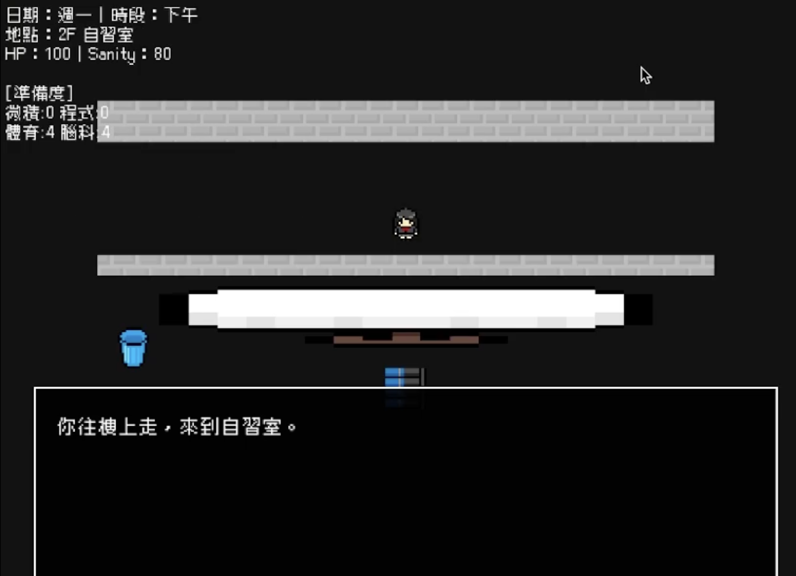
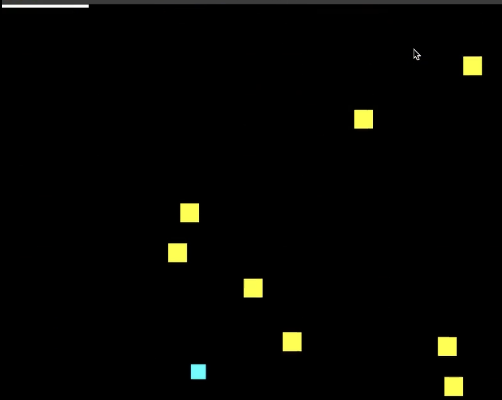

<div align="center">

# 🏛️ HOUSE of FINAL (期末大作戰)


> **"Don't just survive the finals. Break the loop."**<br>
> 一款將大學生「期末焦慮」具象化的 Meta-RPG 生存遊戲。
* **標題彩蛋**：專案名稱與迴圈概念，是對恐怖遊戲 **《HOUSE》** 的致敬，象徵主角被困在名為「期末考」的無盡房屋中。


</div>

---

## 📖 專案背景 (Introduction)

**HOUSE of FINAL** 是一款基於 C++ 與 SFML 引擎開發的 2D 角色扮演遊戲（RPG）。
本專案不僅是對期末考週的生存模擬，更是一次**後設敘事 (Meta-narrative)** 的程式實作嘗試。遊戲試圖打破第四面牆，探討「玩家 vs 系統」與「數據 vs 記憶」的哲學議題。

在這個為期一週的迴圈中，玩家需要平衡 **Sanity (精神值)**、**HP (體力)** 與 **GPA (學業成績)**。但隨著輪迴次數增加，你會發現唯一的出路，或許不是拿到滿分......

---

## ⚡ 技術亮點 (Technical Highlights)

本專案在實作上運用了以下電腦科學概念，將遊戲機制與程式邏輯深度結合：

### 1. 狀態機與時間切片 (State Machine & Time Slices)
* 設計了完整的 Game Loop，將時間離散化為 `Day` (週一至週五) 與 `Slot` (早/午/晚/半夜)。
* 每個 NPC 與物件的互動邏輯皆依賴於全域狀態機 (Global State Machine)，實現非線性的敘事體驗。

### 2. 位元運算視覺故障 (Bitwise Glitch Effect)
* 為了模擬精神崩潰 (Sanity Drop)，不使用預製圖片，而是直接在程式碼層級對字串進行**位元運算 (Bitwise Operations)**。
* 動態隨機替換 ASCII 字元，即時生成「亂碼」與「崩壞」的視覺效果。

### 3. 資料持久化與輪迴 (Data Persistence)
* 利用 C++ `fstream` 進行二進位檔案序列化。
* 遊戲會將「覺醒度 (Awareness)」與「輪迴計數」寫入本機硬碟。即使關閉程式，NPC 仍會「記得」玩家上一次的死亡與選擇，實現 Meta Game 的核心體驗。

### 4. 動態難度調整 (Dynamic Difficulty Adjustment)
* 考試系統採用類似 *Touhou Project* 的彈幕閃避機制。
* 敵人類別與生成速率演算法具有**多型 (Polymorphism)** 特性，會根據玩家該科目的「準備等級 (Prep Level)」即時改變行為模式。

---
## 📸 遊戲畫面 (Gallery)

> *Disclaimer: Most illustrations in this project were generated using AI tools.*
> *(註：本專案背景CG，皆由 AI 工具協助生成。)*

| 🏫 校園探索 | 👾 彈幕考試|
| :---: | :---: |
|  |  |
| *操作像素小人在校園中生存* | *將考試轉化為生存閃避遊戲* |

| 💬 劇情互動 | 🎭 多重結局|
| :---: | :---: |
|  |  |
| *與 NPC 對話挖掘「輪迴」真相* | *包含 True End 在內的 10 種結局* |

---

## 🗣️ 使用者回饋與評價 (User Testimonials)

本專案在期末發表中獲得極高評價，被同儕認為具有獨立遊戲發行的潛力。以下節錄部分回饋：

> **關於程式架構**
> * "專案主題與實作深度都非常突出... 展現出對OOP 與系統設計的深刻理解。"
> * "無論是在資源管理、存檔機制或演算法巧思上，都能看出組員的投入與成熟度。"
> * "介面很豪華，也有滿多函式在負責處理介面顯示... 根本是對初學者的降維打擊。"

> **關於完成度與品質**
> * "這是我目前看到完成度最高的一個 project... 這真的是只學一學期的程式設計就能做的出來的成品嗎？太厲害了！"
> * "完全已經是外面上架遊戲的等級了... 介面非常有真實遊戲的感覺。"

> **關於敘事與機制**
> * "打破第四面牆的後設敘事在期末專案中很少見。"
> * "系統動態崩壞的視覺與邏輯表現... 展現了高超的程式控制能力。"
> * "San 值太低會出現幻覺很可愛，文字亂碼的小巧思非常有克蘇魯遊戲的感覺。"

> **關於沈浸感**
> * "那種期末焦慮的壓抑感被刻畫得很細緻... 是一場深刻的藝術實踐。"
---
## 🚀 如何執行 (Getting Started)

### 編譯與執行 (Mac/Linux)

```bash
# 1. 下載專案
git clone [https://github.com/yiyi42205-ops/HOUSE-of-Final.git](https://github.com/yiyi42205-ops/HOUSE-of-Final.git)
cd HOUSE-of-Final

# 2. 編譯 (使用內附腳本)
# 給予腳本執行權限並執行
chmod +x build.sh
./build.sh

# (或是手動編譯指令：)
# g++ -std=c++17 src/*.cpp -o game -lsfml-graphics -lsfml-window -lsfml-system -lsfml-audio

# 3. 執行
./game
```
## 🚧 未來展望 (Future Roadmap)

這是一個持續迭代的專案。**針對期末發表時收到的使用者回饋**（如：部分裝置文字跑版、音效平衡問題），我們計畫進行以下優化：

* **UI 自適應與除錯**
    針對使用者回報的文字溢出 (Text Overflow) 問題，將實作動態字體縮放，確保在高解析度螢幕下的顯示正常。

* **重構程式架構**
    將 God Class 拆解為 `InputHandler`, `Renderer`, `AudioManager` 等獨立模組，以利於後續功能的擴充。

---

> *Created by Yinglan Hsu for NTU IM Programming Design Course.*
